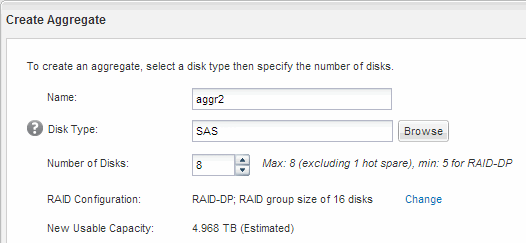

= 建立Aggregate
:allow-uri-read: 
:icons: font
:imagesdir: ../media/

[role="lead"]
如果您不想使用現有的Aggregate、可以建立新的Aggregate、為您要配置的磁碟區提供實體儲存設備。

.步驟
. 輸入 URL `+https://IP-address-of-cluster-management-LIF+` 在網頁瀏覽器中、使用叢集管理員認證登入 System Manager 。
. 瀏覽至* Aggregate *視窗。
. 選取*「Create」（建立）。*
. 依照畫面上的指示、使用預設RAID-DP組態建立Aggregate、然後選取*「Create」（建立）*。
+

.結果
此Aggregate會以指定的組態建立、並新增至Aggregate視窗中的Aggregate清單。
