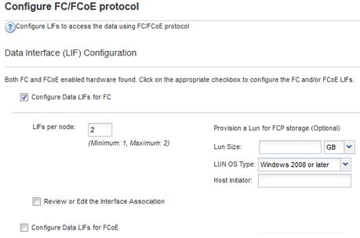

= 在現有SVM上設定FC
:allow-uri-read: 
:icons: font
:imagesdir: ../media/

[role="lead"]
您可以在現有的儲存虛擬機器（SVM）上設定FC、並使用單一精靈建立LUN及其包含Volume的磁碟區。FC傳輸協定必須已啟用、但尚未在SVM上設定。此資訊適用於正在設定多個傳輸協定但尚未設定FC的SVM。

.開始之前
您必須設定FC架構、且所需的實體連接埠必須連接至架構。

.步驟
. 瀏覽至* SVMS*視窗。
. 選取您要設定的SVM。
. 在SVM*詳細資料*窗格中、確認以灰色背景顯示* FC/FCoF*、表示傳輸協定已啟用但尚未完整設定。
+
如果以綠色背景顯示* FC/FCoS*、表示SVM已設定完成。

+
image::../media/existing_svm_protocols_fc_windows.gif[影像顯示詳細資料頁面、其中所有四種傳輸協定都有灰色背景。]

. 按一下背景為灰色的「* FCoE/FCoF*傳輸協定」連結。
+
此時會顯示Configure FC/FCoE Protocol（設定FC/FCoE傳輸協定）視窗。

. 從「*設定FC/FCoE傳輸協定*」頁面設定FC服務和LIF：
+
.. 選取「*設定FC*的資料lifs」核取方塊。
.. 輸入 `2` 在 * 每個節點的生命 * 欄位中。
+
每個節點都需要兩個生命期、以確保可用度和資料移動性。

.. 在*資源配置LUN以供FCP儲存*區域中、輸入所需的LUN大小、主機類型及主機啟動器的WWPN。
.. 按一下*提交並關閉*。

+

. 檢閱* Summary（摘要）*頁面、記錄LIF資訊、然後按一下* OK（確定）*。

