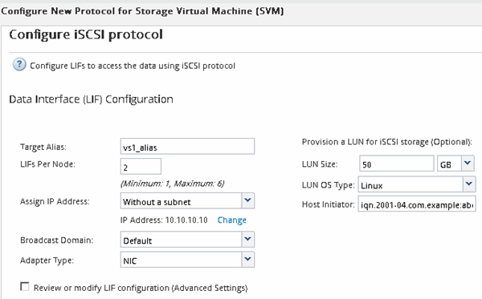

= 在現有SVM上設定iSCSI
:allow-uri-read: 
:icons: font
:imagesdir: ../media/

[role="lead"]
您可以在現有的儲存虛擬機器（SVM）上設定iSCSI、並使用單一精靈建立LUN及其包含Volume的磁碟區。iSCSI傳輸協定必須已啟用、但尚未在SVM上設定。此資訊適用於正在設定多個傳輸協定、但尚未設定iSCSI的SVM。

.開始之前
您必須擁有足夠的網路位址、才能為每個節點建立兩個生命期。

.關於這項工作
LUN會對應到igroup中啟動器的子集、以限制從主機到LUN的路徑數量。

* 利用選擇性LUN對應（SLM),只能透過擁有LUN及其HA合作夥伴的節點路徑存取LUN。ONTAP
* 您仍必須在每個節點上設定所有的iSCSI LIF、以便在LUN移至叢集中的另一個節點時移動LUN。
* 在移動磁碟區或LUN之前、您必須先修改「SLM-報告節點」清單。

.步驟
. 瀏覽至* SVMS*視窗。
. 選取您要設定的SVM。
. 在SVM** Details（SVM**詳細資料）窗格中、確認* iscs*以灰色背景顯示、表示傳輸協定已啟用但尚未完整設定。
+
如果顯示* iscs*時背景為綠色、表示SVM已設定完成。

+
image::../media/existing_svm_protocols_iscsi_rhel.gif[影像顯示詳細資料頁面、其中所有四種傳輸協定都有灰色背景。]

. 按一下背景為灰色的* iSCSI *傳輸協定連結。
+
隨即顯示Configure iSCSI Protocol（設定iSCSI傳輸協定）視窗。

. 從「*設定iSCSI傳輸協定*」頁面設定iSCSI服務和lifs：
+
.. *選用：*輸入目標別名。
.. 輸入 `*2*` 在 * 每個節點的生命 * 欄位中。
+
每個節點都需要兩個生命期、以確保可用度和資料移動性。

.. 為具有子網路或無子網路的生命設備指派IP位址。
.. 在*資源配置LUN用於iSCSI儲存設備*區域中、輸入所需的LUN大小、主機類型及主機的iSCSI啟動器名稱。
.. 按一下*提交並關閉*。

+

. 檢閱* Summary（摘要）*頁面、記錄LIF資訊、然後按一下* OK（確定）*。

