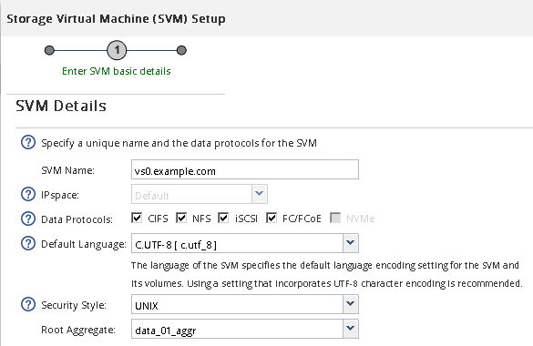

= 建立新的 SVM
:allow-uri-read: 
:icons: font
:imagesdir: ../media/

[role="lead"]
儲存虛擬機器（SVM）提供iSCSI目標、讓主機存取LUN。當您建立SVM時、也會建立邏輯介面（LIF）、LUN及其包含Volume。您可以建立SVM、將使用者的資料和管理功能與叢集中其他使用者的資料和管理功能分開。

.開始之前
* 您必須擁有足夠的網路位址、才能為每個節點建立兩個生命期。

.關於這項工作
LUN會對應到igroup中啟動器的子集、以限制從主機到LUN的路徑數量。

* 根據預設、ONTAP 由於使用選擇性LUN對應（SLM),所以LUN只能透過擁有LUN及其HA合作夥伴的節點上的路徑存取。
* 您仍必須在每個節點上設定所有的iSCSI LIF、以便在LUN移至叢集中的另一個節點時移動LUN。
* 移動磁碟區或LUN時、您必須先修改SLM-報告節點清單、然後再移動。

.步驟
. 瀏覽至* SVMS*視窗。
. 按一下「 * 建立 * 」。
. 在* Storage Virtual Machine（SVM）Setup（*儲存虛擬機器（SVM）設定*）視窗中、建立SVM：
+

+
.. 指定SVM的唯一名稱。
+
名稱必須是完整網域名稱（FQDN）、或遵循另一種慣例、確保整個叢集都有獨特的名稱。

.. 選取SVM所屬的IPspace。
+
如果叢集不使用多個IPspaces、則會使用「預設」IPspace。

.. 保留預設的Volume類型選擇。
+
SAN傳輸協定僅支援部分。FlexVol

.. 選取您擁有SVM授權的所有傳輸協定、即使您不想立即設定所有傳輸協定、也可以在SVM上使用這些傳輸協定。
+
在建立SVM時同時選取NFS和CIFS、可讓這兩種傳輸協定共用相同的LIF。稍後再新增這些通訊協定、並不允許它們共用生命期。

+
如果CIFS是您選取的其中一個傳輸協定、則安全樣式會設定為NTFS。否則、安全樣式會設為UNIX。

.. 保留預設語言設定C.UTF-8。
.. 選取所需的根Aggregate、以包含SVM根磁碟區。
+
資料磁碟區的Aggregate會在稍後的步驟中個別選取。

.. 按一下*提交並繼續*。

+
SVM已建立、但尚未設定傳輸協定。

. 如果由於您啟用CIFS或NFS而出現「*設定CIFS/NFS傳輸協定*」頁面、請按一下「*跳過*」、然後稍後設定CIFS或NFS。
. 從「*設定iSCSI傳輸協定*」頁面設定iSCSI服務並建立lifs、LUN及其包含Volume：
+
.. *選用：*輸入目標別名。
.. 使用子網路或不使用子網路來指派生命設備的IP位址。
.. 輸入 `*2*` 在 * 每個節點的生命 * 欄位中。
+
每個節點都需要兩個生命期、以確保可用度和資料移動性。

.. 在*資源配置LUN用於iSCSI儲存設備*區域中、輸入所需的LUN大小、主機類型及主機的iSCSI啟動器名稱。
.. 按一下*提交並繼續*。

+
image::../media/create_new_svm_wizard_iscsi_details_linux.gif[圖例顯示SVM設定精靈的步驟3：填寫iSCSI詳細資料。]

. 如果由於您啟用FC而出現「*組態FC/FCoE傳輸協定*」頁面、請按一下「*跳過*」、然後稍後再設定FC。
. 出現* SVM管理*時、請設定或延後設定此SVM的個別管理員：
+
** 按一下「*跳過*」、然後視需要稍後設定管理員。
** 輸入要求的資訊、然後按一下*提交並繼續*。

. 檢閱* Summary（摘要）*頁面、記錄LIF資訊、然後按一下* OK（確定）*。

