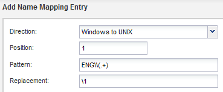

= 對應UNIX和Windows使用者名稱
:allow-uri-read: 
:icons: font
:imagesdir: ../media/

[role="lead"]
如果您的網站同時擁有Windows和UNIX使用者帳戶、您應該使用名稱對應來確保Windows使用者能夠存取具有UNIX檔案權限的檔案、並確保UNIX使用者能夠存取具有NTFS檔案權限的檔案。名稱對應可能涉及任何內含對應、轉換規則及預設使用者的組合。

.關於這項工作
只有當您的網站有Windows和UNIX使用者帳戶並未隱含對應時、才應使用此程序、亦即每個Windows使用者名稱的小寫版本都與UNIX使用者名稱相符時。這可以使用NIS、LDAP或本機使用者來完成。如果您有兩組使用者不相符、則應設定名稱對應。

.步驟
. 請考慮下列因素、決定名稱對應轉換規則、預設使用者對應或兩者的方法：
+
** 轉換規則會使用規則運算式將一個使用者名稱轉換成另一個使用者名稱、如果您想要控制或追蹤個別層級的存取權限、這很實用。
+
例如、您可以將UNIX使用者對應至網域中的Windows使用者、反之亦然。

** 預設使用者可讓您將使用者名稱指派給所有未被內含對應或名稱對應轉換規則對應的使用者。
+
每個SVM都有一個名為「'pcuser'」的預設UNIX使用者、但沒有預設的Windows使用者。

. 瀏覽至* SVMS*視窗。
. 選取您要設定的SVM。
. 按一下「* SVM設定*」索引標籤。
. *選用*：建立名稱對應、將UNIX使用者帳戶轉換成Windows使用者帳戶、反之亦然：
+
.. 在*主機使用者與群組*窗格中、按一下*名稱對應*。
.. 按一下「*新增*」、保留預設的* Windows至UNIX*方向、然後建立當Windows使用者嘗試存取使用UNIX檔案權限的檔案時產生UNIX認證的規則運算式。
+
使用下列項目、將英文網域中的任何Windows使用者轉換成同名的UNIX使用者。模式 `ENG\\(.+)` 尋找任何具有前置碼的 Windows 使用者名稱 `ENG\\`和更換 `\1` 移除使用者名稱以外的所有項目以建立 UNIX 版本。

+

.. 按一下「**新增」、選取* UNIX至Windows *方向、然後建立對應的對應、以便在UNIX使用者嘗試存取具有NTFS檔案權限的檔案時產生Windows認證。
+
使用下列項目、將每個UNIX使用者轉換成英文網域中同名的Windows使用者。模式 `(.+)` 尋找任何 UNIX 名稱及取代項目 `ENG\\\1` 插入來產生 Windows 版本 `ENG\\` 使用者名稱之前。

+

.. 由於每項規則的位置決定了規則的套用順序、因此您應該檢閱結果、確認訂單符合您的期望。
+
image::../media/name_mappings_3_outcome.gif[此圖形由周圍的文字說明。]

.. 重複步驟5b到5d、對應SVM上的所有網域和名稱。

. *選用*：建立預設的Windows使用者：
+
.. 在LDAP、NIS或SVM的本機使用者中建立Windows使用者帳戶。
+
如果您使用本機使用者、可以在「主機使用者與群組」窗格的* Windows *下建立帳戶。

.. 在*傳輸協定*窗格中選取* NFS*>*編輯*、然後輸入使用者名稱、即可設定預設的Windows使用者。

+
您可以建立名為「unixuse...」的本機Windows使用者、並將其設為預設的Windows使用者。

. *選用*：如果您希望使用者與預設值不同（即「pcuser'」使用者）、請設定預設UNIX使用者。
+
.. 在LDAP、NIS或SVM的本機使用者中建立UNIX使用者帳戶。
+
如果您使用本機使用者、可以在「主機使用者與群組」窗格的* UNIX*下建立帳戶。

.. 在*傳輸協定*窗格中選取* CIFS/*>*選項*、然後輸入使用者名稱、即可設定預設的UNIX使用者。

+
您可以建立名為「winuse'」的本機UNIX使用者、並將其設為預設UNIX使用者。

== 接下來該怎麼做

如果您設定了預設使用者、則稍後在工作流程中設定檔案權限時、應該設定預設Windows使用者和預設UNIX使用者的權限。
