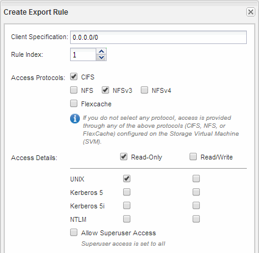

= 開啟SVM根磁碟區的匯出原則（建立新的NFS型SVM）
:allow-uri-read: 
:icons: font
:imagesdir: ../media/

[role="lead"]
您必須新增規則至預設匯出原則、以允許所有用戶端透過NFSv3存取。如果沒有這樣的規則、所有NFS用戶端都會被拒絕存取儲存虛擬機器（SVM）及其磁碟區。

.關於這項工作
您應該將所有NFS存取指定為預設匯出原則、之後再建立個別磁碟區的自訂匯出原則、以限制個別磁碟區的存取。

.步驟
. 瀏覽至* SVMS*視窗。
. 按一下「* SVM設定*」索引標籤。
. 在「*原則*」窗格中、按一下「*匯出原則*」。
. 選取名為*預設*的匯出原則、該原則會套用至SVM根磁碟區。
. 在下方窗格中、按一下*「Add*（新增*）」。
. 在「*建立匯出規則*」對話方塊中、建立一個規則、以開啟對所有NFS用戶端的存取權：
+
.. 在 * 用戶端規格 * 欄位中、輸入 `0.0.0.0/0` 如此一來、規則就能套用至所有用戶端。
.. 保留規則索引的預設值* 1*。
.. 選取 * NFSv3* 。
.. 清除「*唯讀*」下的所有核取方塊（* UNIX*核取方塊除外）。
.. 按一下「*確定*」。

+

.結果
NFSv3用戶端現在可以存取在SVM上建立的任何磁碟區。
