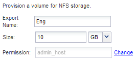

= 新增NFS存取至現有SVM
:allow-uri-read: 
:icons: font
:imagesdir: ../media/

[role="lead"]
新增NFS存取至現有SVM時、需要建立資料LIF、選擇性地設定NIS、配置Volume、匯出Volume、以及設定匯出原則。

.開始之前
* 您必須知道SVM將使用下列哪些網路元件：
+
** 將在該節點上建立資料邏輯介面（LIF）的節點和特定連接埠
** 要配置資料LIF IP位址的子網路、或是您要指派給資料LIF的特定IP位址（可選）

* 任何外部防火牆都必須適當設定、才能存取網路服務。
* SVM上必須允許NFS傳輸協定。

如需詳細資訊、請參閱 link:https://docs.netapp.com/us-en/ontap/networking/index.html["網路管理文件"^]。

.步驟
. 瀏覽至可設定SVM傳輸協定的區域：
+
.. 選取您要設定的SVM。
.. 在* Details（詳細資料）*窗格中、於*傳輸協定*旁按一下* NFS*。
+
image::../media/svm_add_protocol_nfs_nfs.gif[此影像由周邊文字說明。]

. 在「*設定NFS傳輸協定*」對話方塊中、建立資料LIF。
+
.. 從您指定的子網路自動指派IP位址給LIF、或手動輸入位址。
.. 按一下*瀏覽*、然後選取與LIF相關聯的節點和連接埠。
+
image::../media/svm_setup_cifs_nfs_page_lif_multi_nas_nfs.gif[此圖形由其周邊文字說明。]

. 如果站台使用NIS進行名稱服務或名稱對應、請指定NIS伺服器的網域和IP位址、然後選取要新增NIS名稱服務來源的資料庫類型。
+
image::../media/svm_setup_cifs_nfs_page_nis_area_nfs.gif[此圖形由周圍的文字說明。]

+
如果NIS服務無法使用、請勿嘗試進行設定。不當設定的NIS服務可能會導致資料存放區存取問題。

. 建立及匯出用於NFS存取的磁碟區：
+
.. 對於*匯出名稱*、請輸入匯出名稱和磁碟區名稱的開頭。
.. 指定要包含檔案的磁碟區大小。
+

+
您不需要為磁碟區指定集合體、因為它會自動位於具有最大可用空間的集合體上。

.. 在*權限*欄位中、按一下*變更*、然後指定允許NFSv3存取UNIX管理主機的匯出規則、包括進階使用者存取權。
+
image::../media/export_rule_for_admin_manual_nfs_nfs.gif[此影像由周邊文字說明。]

+
您可以建立名為Eng的10 GB磁碟區、將其匯出為Eng、並新增規則、讓「admin_host'」用戶端能夠完整存取匯出內容、包括超級使用者存取權。

. 按一下*提交並關閉*、然後按一下*確定*。

