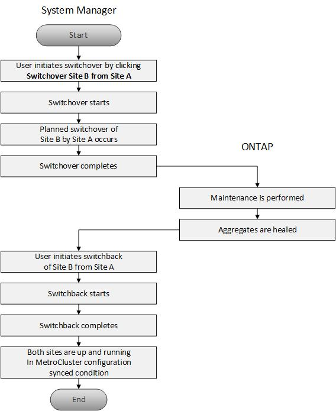

= 關於MetroCluster 還原切換和切換
:allow-uri-read: 
:icons: font
:imagesdir: ../media/

[role="lead"]
從ONTAP 《支援支援不中斷系統的支援》9.6開始、MetroCluster 您可以在災難發生後使用「還原切換」和「切換」作業、使來源叢集中的所有節點無法連線並關機。您也可以使用切換工作流程來進行協調（規劃）切換、以便在災難恢復測試或站台離線進行維護等情況下進行切換。

== 關於MetroCluster 還原切換和切換

從System Manager 9.6開始、您可以使用MetroCluster 還原切換和切換作業、讓一個叢集站台接管另一個叢集站台的工作。此功能可讓您協助進行災難的維護或恢復。

切換作業可讓一個叢集（站台A）接管另一個叢集（站台B）通常執行的工作。切換後、已接管的叢集（站台B）可停機以進行維護和修復。維護完成後、站台B就會啟動並完成修復工作、接著您可以啟動切換作業、讓修復的叢集（站台B）恢復正常執行的工作。

System Manager可根據遠端叢集站台的狀態、支援兩種切換作業：

* 協調（計畫性）切換：當您需要在叢集上進行計畫性維護或測試災難恢復程序時、請啟動此作業。
* 非計畫性切換：當叢集（站台B）發生災難、而您希望另一個站台或叢集（站台A）在執行修復與維護時、接管受災難影響的叢集工作（站台B）時、就會啟動此作業。

您可以在System Manager中執行相同的步驟來執行這兩項切換作業。當您啟動切換時、System Manager會判斷作業是否可行、並據此調整工作負載。

== 還原切換和切換工作流程MetroCluster

切換和切換工作流程的整體流程包括下列三個階段：

. *切換*：切換程序可讓您將儲存設備和用戶端存取的控制權、從來源叢集站台（站台B）傳輸到另一個叢集站台（站台A）。此作業可協助您在測試與維護期間提供不中斷營運的服務。此外、此程序也可讓您從站台故障中恢復。對於災難恢復測試或規劃的站台維護、您可以執行MetroCluster 還原切換、將控制權移交給災難恢復（DR）站台（站台A）。在您開始進行切換之前、至少必須先啟動並執行其中一個正常運作的站台節點、才能執行切換。如果切換作業先前在DR站台的某些節點上失敗、則可在所有節點上重試該作業。
. *站台B作業*：完成切換後、System Manager將完成MetroCluster 修復程序、以利執行此動作。修復是一項計畫性事件、可讓您完全掌控每個步驟、將停機時間降至最低。修復是在儲存設備和控制器元件上執行的兩階段程序、可讓修復站台上的節點做好準備、以利切換程序。在第一階段中、程序會重新同步鏡射叢集、然後將根集合體切換回災難站台、藉此將其變回集合體。
+
在第二階段中、站台已準備好進行切換程序。

. *切換回復*：在站台B上執行維護與修復之後、您將啟動切換作業、以恢復站台A對站台B的儲存與用戶端存取控制權若要成功切換、必須符合下列條件：
+
** 主節點和儲存磁碟櫃必須由站台A的節點開啟和存取
** System Manager必須已成功完成修復階段、才能啟動切換作業。
** 站台A中的所有集合體均應處於鏡射狀態、且無法處於降級或重新同步狀態。
** 執行切換作業之前、必須先完成所有先前的組態變更。如此可避免這些變更與議定的切換或切換作業競爭。

== 流程圖：切換和切換工作流程流程圖MetroCluster

下列流程圖說明啟動切換和切換作業時所發生的階段和程序。

