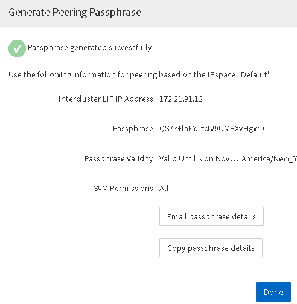

= 建立叢集對等關係（從ONTAP 功能9.3開始）
:allow-uri-read: 
:icons: font
:imagesdir: ../media/

[role="lead"]
從ONTAP 功能更新至ONTAP 功能更新9.7開始、您可以使用ONTAP 《系統管理程式_classic_介面》、提供系統產生的通關密碼和遠端叢集叢集間連線的IP位址、在兩個叢集之間建立叢集對等關係。

.關於這項工作
從ONTAP 推出支援支援功能的9.6開始、所有新建立的叢集對等關係、預設都會啟用叢集對等加密。叢集對等加密必須手動啟用、才能在升級ONTAP 至32．6之前建立對等關係。叢集對等加密無法用於執行ONTAP 版本不符合更新版本的叢集。因此、對等關係中的兩個叢集都必須執行ONTAP 支援功能的支援功能、才能啟用叢集對等加密。

叢集對等加密使用傳輸安全層（TLS）來保護跨叢集對等通訊、以實現ONTAP SnapMirror和FlexCache SnapMirror等功能。

.步驟
. 在「*目標叢集叢集間LIF IP位址*」欄位中、輸入遠端叢集間LIF的IP位址。
. [[step2-sphrides]]從遠端叢集產生通關密碼。
+
.. 指定遠端叢集的管理位址。
.. 按一下*管理URL*、即可在ONTAP 遠端叢集上啟動《系統管理程式》。
.. 登入遠端叢集。
.. 在*叢集對等端點*視窗中、按一下*產生對等複雜密碼*。
.. 選取IPspace、通關密碼的有效性及SVM權限。
+
您可以允許所有的SVM或選取的SVM進行對等處理。產生SVM對等要求時、允許的SVM會自動與來源SVM進行對等關係、而不需要您接受遠端SVM的對等關係。

.. 按一下*產生*。
+
隨即顯示通關密碼資訊。

+

.. 按一下*複製通關密碼詳細資料*或*電子郵件通關密碼詳細資料*。
.. 按一下「 * 完成 * 」。

. 在來源叢集中、輸入您在中取得的產生通關密碼 <<step2-passphrase,步驟 2>>。
. 按一下*啟動叢集對等關係*。
+
已成功建立叢集對等關係。

. 按一下 * 繼續 * 。

== 接下來該怎麼做

您應該在SVM對等窗口中指定SVM詳細資料、以繼續對等程序。
