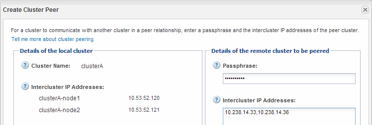
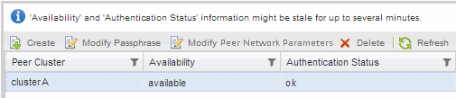

= 建立叢集對等關係ONTAP （不含版本號的9.2）
:allow-uri-read: 
:icons: font
:imagesdir: ../media/

[role="lead"]
使用ONTAP 包含ONTAP Estraps9.2或更早ONTAP 版本的《SUREY9系統管理程式_classic_介面》、您可以輸入預先定義的通關密碼和遠端叢集內叢集生命體的IP位址、在兩個叢集之間建立叢集對等關係。 然後驗證關係是否已成功建立。

.開始之前
* 您必須知道要對等叢集的所有叢集間生命體的IP位址。
* 您必須知道每個對等關係將使用的通關密碼。

.關於這項工作
您必須在每個叢集上執行此程序。

.步驟
. 從來源叢集建立與目的地叢集的叢集對等關係。
+
.. 按一下「*組態*」索引標籤。
.. 在*叢集設定*窗格中、按一下*叢集對等端點*。
.. 按一下「 * 建立 * 」。
+
此時將顯示「*建立叢集對等點*」對話方塊。

.. [[step1d-phr密碼-used]在*要處理的遠端叢集詳細資料*區域中、指定兩個對等端用來確保已驗證叢集對等關係的密碼。
.. 輸入目的地叢集（每個節點一個）的所有叢集間LIF的IP位址、並以逗號分隔。
+

.. 按一下「 * 建立 * 」。
+
驗證狀態為「擱置」、因為只設定了一個叢集。

. 切換至目的地叢集、然後與來源叢集建立叢集對等關係：
+
.. 按一下「*組態*」索引標籤。
.. 在*叢集設定*窗格中、按一下*叢集對等端點*。
.. 按一下「 * 建立 * 」。
+
隨即顯示Create Cluster Peer（建立叢集對等方）對話方塊。

.. 在*要執行的遠端叢集詳細資料*區域中、指定您在中指定的相同通關密碼 <<step1d-passphrase-used,步驟1d>> 以及來源叢集的叢集間生命體IP位址、然後按一下*「Create」（建立）*。

+
image::../media/cluster_peer_create_2.gif[此影像由周邊文字說明。]

. 從目的地叢集的*叢集對等端點*視窗、確認來源叢集為「可用」、驗證狀態為「OK」。
+

+
您可能必須按一下*重新整理*來檢視更新的資訊。

+
這兩個叢集處於對等關係中。

. 切換至來源叢集、確認目的地叢集為「可用」、驗證狀態為「OK」。
+
您可能必須按一下*重新整理*來檢視更新的資訊。

== 接下來該怎麼做

在來源磁碟區和目的地磁碟區之間建立SVM對等關係、同時建立來源磁碟區與目的地磁碟區之間的資料保護關係。

link:../volume-backup-snapvault/index.html["使用SnapVault 功能進行Volume備份"]

link:../volume-disaster-recovery/index.html["Volume災難恢復準備"]
