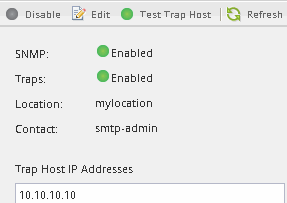

= 驗證是否已啟用SNMP
:allow-uri-read: 
:icons: font
:imagesdir: ../media/

[role="lead"]
您可以搭配ONTAP 使用支援ONTAP 更新版本的支援功能、以驗證叢集上是否已啟用SNMP。

.關於這項工作
在ONTAP 所有版本的支援中、預設會在叢集層級啟用v3、預設會停用SNMPv1和SNMPv2c。建立SNMP社群時、會啟用SNMP v1和SNMP v2c。

依預設、SNMP會在資料生命量上停用。如需在資料lifs上啟用SNMP的相關資訊、請參閱 https://docs.netapp.com/us-en/ontap/networking/index.html["網路管理"^]。

.步驟
. 按一下「切槽」圖示。
. 在*設定*窗格中、瀏覽至* SNMP *視窗。
+

+
您可以檢視叢集的目前SNMP狀態。

+
如果未啟用SNMP、請按一下「*啟用*」。

