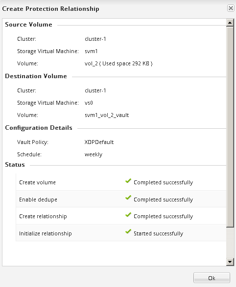

= 建立SnapVault 不二關係ONTAP （例如、0、9.2或更早版本）
:allow-uri-read: 
:icons: font
:imagesdir: ../media/

[role="lead"]
您必須在SnapVault 一個叢集上的來源Volume和連接叢集上的目的地Volume之間建立一個不二元關係、才能建立SnapVault 一個不二元的備份。

.開始之前
* 您必須擁有目的地叢集的叢集管理員使用者名稱和密碼。
* 目的地Aggregate必須有可用空間。

.關於這項工作
您必須從*來源*叢集執行此工作。

.步驟
. 按一下「*儲存設備*>* SVMS*」。
. 選取SVM、然後按一下* SVM設定*。
. 按一下「* Volumes *（*磁碟區*）
. 選取您要備份的磁碟區、然後按一下*保護*。
. 在「*建立保護關係*」對話方塊中、從「*關係類型*」下拉式清單中選取「* Vault *」。
. 在「*目的地Volume *」區段中、選取已連接的叢集。
. 指定目的地Volume的SVM：
+
|===
| 如果SVM是... | 然後... 

 a| 
很好
 a| 
從清單中選取已啟用的SVM。

 a| 
不需要
 a| 
.. 選取SVM。
.. 按一下*驗證*。
.. 輸入所連接叢集的叢集管理員認證、然後按一下*「Create」（建立）*。

|===
. 建立新的目的地Volume：
+
.. 選擇*新Volume *選項。
.. 使用預設磁碟區名稱或輸入新的磁碟區名稱。
.. 選取目的地Aggregate。
.. 確保選中* Enable Dedupe（啟用重複資料刪除）*核取方塊。

+
image::../media/dest_vol_snapvault.gif[目的地SnapVault 功能]

. 在 * 組態詳細資料 * 區段中、選取 `XDPDefault` 保護原則。
. 從排程清單中選取保護排程。
. 確保選中*初始化關係*複選框以傳輸基礎Snapshot複本，然後單擊*創建*
+
image::../media/config_details_snapvault.gif[組態詳細資料SnapVault]

+
精靈會建立與指定資料保險箱原則和排程的關係。此關係是透過從來源磁碟區開始基準傳輸資料至目的地磁碟區來初始化。

+
「狀態」區段會顯示每個工作的狀態。

+

. 確認 SnapVault 關係的關係狀態位於中 `Snapmirrored` 州/省。
+
.. 從Volumes（磁碟區）清單中選取磁碟區、然後按一下* Data Protection（資料保護）*。
.. 在 * 資料保護 * 底部索引標籤中、確認您建立的 SnapMirror 關係已列出、且關係狀態為 `Snapmirrored` 而且類型是 `Vault`。
+
image::../media/data_protection_window_sv.gif[資料保護所需時間]

