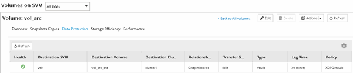

= 建立SnapVault 不合作關係（從ONTAP 功能9.3開始）
:allow-uri-read: 
:icons: font
:imagesdir: ../media/

[role="lead"]
您必須在SnapVault 一個叢集上的來源Volume和連接叢集上的目的地Volume之間建立一個不二元關係、才能建立SnapVault 一個不二元的備份。

.開始之前
* 您必須擁有目的地叢集的叢集管理員使用者名稱和密碼。
* 目的地Aggregate必須有可用空間。

.關於這項工作
您必須從*來源*叢集執行此工作。

.步驟
. 按一下「*儲存設備*>*磁碟區*」。
. 選取您要備份的磁碟區、然後按一下「*動作*」>「*保護*」。
+
您也可以選取多個來源Volume、然後SnapVault 使用單一目的地Volume建立彼此之間的不穩定性關係。

. 在「* Volume：Protect Volumes *」（*磁碟區：保護磁碟區*）頁面中、提供下列資訊：
+
.. 從「*關係類型*」下拉式清單中選取「* Vault *」。
.. 選取目的地叢集、目的地SVM及目的地Volume的尾碼。
+
目的地SVM下方只會列出經過對等程序的SVM和允許的SVM。

+
系統會自動建立目的地Volume。目的地Volume的名稱是附加後置的來源Volume名稱。

.. 按一下 image:../media/advanced_options_icon_backup.gif[""]。
.. 在 * 進階選項 * 對話方塊中、確認 * 保護原則 * 設定為 `XDPDefault`。
.. 選取*保護排程*。
+
依預設 `daily` 排程已選取。

.. 確認已選取* Yes*來初始化SnapVault 「不實」關係。
+
所有資料保護關係依預設都會初始化。

.. 按一下「*套用*」以儲存變更。
+
image::../media/snapvault_advanced_options.gif[進階選項SnapVault]

. 在「* Volume：Protect Volumes*」（*磁碟區：保護磁碟區*）頁面中、按一下「*驗證*」以驗證磁碟區是否具有相符的SnapMirror標籤。
. 按一下*「Save」（儲存）*建立SnapVault 「S動關聯」。
. 確認 SnapVault 關係的狀態位於 `Snapmirrored` 州/省。
+
.. 瀏覽至* Volumes（磁碟區）*視窗、然後選取要備份的磁碟區。
.. 展開磁碟區、然後按一下* protection *以檢視磁碟區的資料保護狀態。

+

