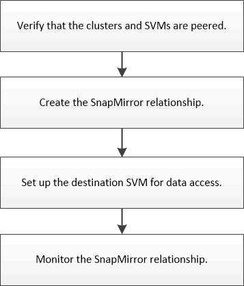

= Volume災難恢復準備工作流程
:allow-uri-read: 
:icons: font
:imagesdir: ../media/

[role="lead"]
準備磁碟區以進行災難恢復、包括驗證叢集對等關係、在掛接叢集上的磁碟區之間建立SnapMirror關係、設定目的地SVM以進行資料存取、以及定期監控SnapMirror關係。

您可以取得其他文件來協助您啟動目的地Volume、以測試災難恢復設定或發生災難時。您也可以深入瞭解如何在災難發生後重新啟動來源Volume。

xref:../volume-disaster-recovery/index.html[Volume災難恢復]

+
說明如何在災難發生後快速啟動目的地Volume、然後重新啟動ONTAP 來源Volume。
