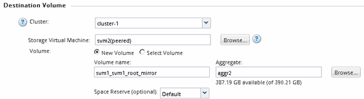

= 建立SnapMirror關係ONTAP （不含版本號的9.2）
:allow-uri-read: 
:icons: font
:imagesdir: ../media/

[role="lead"]
您必須在一個叢集上的來源磁碟區與連接叢集上的目的地磁碟區之間建立SnapMirror關係、以便複寫資料以進行災難恢復。

.開始之前
* 您必須擁有目的地叢集的叢集管理員使用者名稱和密碼。
* 目的地Aggregate必須有可用空間。
* 這兩個叢集都必須適當設定和設定、以符合環境的使用者存取、驗證及用戶端存取需求。

.關於這項工作
您必須從*來源*叢集執行此工作。

.步驟
. 按一下「*儲存設備*>* SVMS*」。
. 選取SVM、然後按一下* SVM設定*。
. 按一下「* Volumes *（*磁碟區*）
. 選取您要建立鏡射關係的磁碟區、然後按一下*保護*。
+
隨即顯示Create Protection Relationship（建立保護關係）視窗。

. 在「*關係類型*」區段中、從「*關係類型*」下拉式清單中選取「*鏡射*」。
. 在「*目的地Volume *」區段中、選取已連接的叢集。
. 指定目的地Volume的SVM：
+
|===
| 如果SVM是... | 然後... 

 a| 
很好
 a| 
從清單中選取已啟用的SVM。

 a| 
不需要
 a| 
.. 選取SVM。
.. 按一下*驗證*。
.. 輸入所連接叢集的叢集管理員認證、然後按一下*「Create」（建立）*。

|===
. 建立新的目的地Volume：
+
.. 選擇*新Volume *選項。
.. 使用預設磁碟區名稱或指定新的磁碟區名稱。
.. 選取目的地Aggregate。

+

. 在「*組態詳細資料*」區段中、選取「* MirrorAllSnapshot*」做為鏡射原則。
+
`DPDefault` 和 `MirrorLatest` 是 SnapMirror 關係可用的其他預設鏡像原則。

. 從排程清單中選取保護排程。
. 確保選中*初始化關係*複選框，然後單擊*創建*。
+
初始化SnapMirror關係可確保目的地磁碟區具有基礎、可開始保護來源磁碟區。

+
image::../media/create_snapmirror_relationship_window.gif[Create SnapMirror Window （創建 SnapMirror 窗口）]

+
此關係是透過從來源磁碟區開始基準傳輸資料至目的地磁碟區來初始化。

+
初始化作業可能需要一些時間。「狀態」區段會顯示每個工作的狀態。

+
image::../media/snapmirror_create_3_successful.gif[成功建立 SnapMirror]

. 驗證SnapMirror關係的關係狀態：
+
.. 從「* Volumes *（*磁碟區*）」清單中選取您建立SnapMirror關係的磁碟區、然後按一下「* Data Protection（*資料保護）」。
.. 在 * Data Protection * 標籤中、確認您建立的 SnapMirror 關係已列出、且關係狀態為 `Snapmirrored`。
+
image::../media/snapmirror_create_4_verify.gif[確認已建立關係]

== 接下來該怎麼做

您必須記下來源磁碟區的設定、例如精簡配置、重複資料刪除、壓縮及自動擴充。當您中斷SnapMirror關係時、可以使用此資訊來驗證目的地Volume設定。
