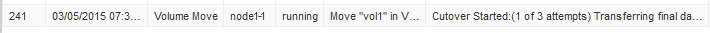

= 使用System Manager移動磁碟區
:allow-uri-read: 
:icons: font
:imagesdir: ../media/

[role="lead"]
使用包含Estraps9.7或更早版本的ONTAP 《系統管理程式_classic_介面ONTAP 》、您可以選取Volume和目的地Aggregate、開始Volume Move作業、並選擇性地監控Volume Move工作、來移動Volume。使用 System Manager 時、磁碟區移動作業會自動完成。

.開始之前
在磁碟區移動作業之前和磁碟區移動作業之後、您應該已經檢閱來源Aggregate和目的地Aggregate上的可用空間。

.關於這項工作
僅在同一個叢集內支援Volume Move作業。此外、您應該注意、您要將磁碟區移至的集合體、以及您要從中移動磁碟區的集合體、必須位於相同的儲存虛擬機器（SVM）中。磁碟區移動不會中斷用戶端存取。

.步驟
. 瀏覽至* Volumes *（*磁碟區*）視窗。
. 選取您要移動的磁碟區、然後按一下「*動作*」>「*移動*」。
. 選取目的地Aggregate、然後開始磁碟區移動作業：
+
.. 從可能的集合體清單中選取目的地Aggregate、其中僅包含具有所需容量的集合體。
+
您應該檢閱集合體的可用空間、總空間、RAID類型和儲存類型。例如、如果目標是改變磁碟區的效能特性、您可以將焦點放在具有所需儲存類型的集合體上。

.. 按一下「*移動*」、然後再按一下「*移動*」、確認您要繼續進行Volume Move作業。
+
顯示「Move Volume」（移動Volume）對話方塊時、如果您要監控Volume移動工作、請保持對話方塊開啟。

. *選用：*[step4-監 控]監控Volume Move工作：
+
.. 在*移動Volume *對話方塊中、按一下磁碟區移動工作*工作ID*的連結。
.. 找到Volume Move工作、然後檢閱「* Status *（*狀態*）」欄中的資訊。
+
工作可處於多個階段的任一階段、例如傳輸資料的初始基準線或開始轉換嘗試。

+

.. 按一下「*工作*」視窗中的「*重新整理*」、即可檢視更新的工作狀態。
+
image::../media/volume_move_4_job_is_successful.gif[此影像由周邊文字說明。]

+
工作狀態會變更為 `Complete: Successful` 當 Volume Move 作業完成時。

. 如果Volume Move工作進入轉換延後階段、請執行手動轉換。
+
.. 從* Volumes（磁碟區）*視窗中、選取您啟動磁碟區移動工作的磁碟區。
.. 針對Volume啟動轉換：
+
|===

| 如果您正在執行... | 執行下列步驟... 

 a| 
不含更新版本ONTAP
 a| 
... 展開磁碟區、然後按一下「*顯示更多詳細資料*」連結、即可檢視更多有關磁碟區的資訊。
... 在「*總覽*」標籤中、按一下「*轉換*」。

 a| 
0：2或更低版本ONTAP
 a| 
在* Volume Move Details（* Volume Move Details）*標籤中、按一下* Cutover *。

|===
.. 在*轉換*對話方塊中、按一下*進階選項*。
.. 指定切換動作和切換持續時間。
+
image::../media/vol_move_cutover.gif[此影像由周邊文字說明。]

.. 按一下「*確定*」。

. 重複 <<step4-monitor,步驟 4>>。

